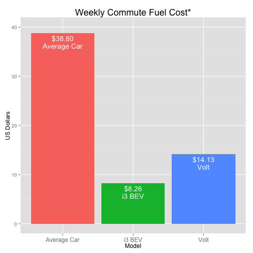

---
title       : Electrification of Vehicles
subtitle    : Helping Consumers Compare
author      : 
job         : 
framework   : io2012    # {io2012, html5slides, shower, dzslides, ...}
#revealjs    : {theme: sky, transition: linear}
#highlighter : highlight.js  # {highlight.js, prettify, highlight}
hitheme     : solarized_light     # 
#widgets     : [bootstrap]            # {mathjax, quiz, bootstrap}
mode        : selfcontained # {standalone, draft}
knit        : slidify::knit2slides
assets:
  js:
    - "http://ajax.googleapis.com/ajax/libs/jqueryui/1.10.3/jquery-ui.min.js"
    - "http://bartaz.github.io/sandbox.js/jquery.highlight.js"
--- transition: cube 

## Vehicle Landscape is Changing

### Here come the plugins
- More vehicles are being introduced with plugs
- Consumers are wondering what does it cost to operate
- A major operating costs is fuel used during weekly commute
- Consumers want to know `"how much to fill up the tank?"`

### Challenge
- Gas prices vary by location
- Electricity rates vary by location
- Different people have different commutes
- What if the car only uses electricity part of the time?

--- 

## A First Step - Calculate Cost of Weekly Commute

- Allow user to select up to two alternative energy vehicles
- Allow user to change daily commute distance
- Allow user to adjust gas and electrity prices
- For reference, compare to average US car
- Use EPA data for calculations
- Show user weekly cost to power chosen vehicle to and from work

--- .font-size: 8 

## Type of Simplified Results User Will See

```r
ggplot(out, aes(x=Model, y=Cost, fill=Model)) + geom_bar(stat="identity") + geom_text(aes(label=dispCost), vjust=1.5, colour="white") + geom_text(aes(label=Model), vjust=3, colour="white") + ggtitle("Weekly Commute Fuel Cost*") + ylim(0,maxY) +  ylab("US Dollars") + theme(axis.text.x=element_text(size=12),plot.title=element_text(size=18)) + guides(fill=FALSE)
```


 


--- 

## Future Enhancements

- Allow user to pick their gas car for comparison
- Allow user to adjust percent highway and city of commute
- Allow user to add side trips and weekends
- Compute Monthly and Yearly Costs
- Allow user to enter one-time trips

## Give it a try now
[Weelky Commut Cost Comparison](http://hsparra.shinyapps.io/mpg_comparison/)
